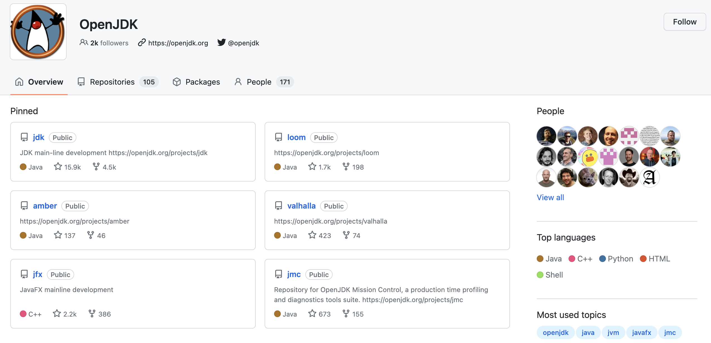

Git 版本管理系统由 Linux 的作者 Linus Torvalds 于 2005 年创造，至今不到二十年。

起初，Git 用于 Linux Kernel 的协同开发，用于替代不再提供免费许可的 BitKeeper 软件。随后，这一提供轻量级分支的分布式版本管理系统得到了开源开发者的广泛喜爱，在大量开源项目中投入使用。如今，Git 几乎是版本管理系统的同义词。

Git 最大的创新就是轻量级的分支实现，鼓励分布式的开发者群体创建自己的分支。每个分支都是平等的，只是原始作者的分支或者实现最好的分支会被社群公认为上游，其他分支被认为是下游。下游分支的修改通过邮件列表发送补丁或 GitHub 发起 Pull Request 的方式向上游申请合并，最后大部分用户从上游分支取得源代码使用。

在这个模型下，如何协同不同分支的开发，当上游发布了多个版本，尤其是并行维护多个发布版本时，如何管理分支，就是一个亟需解决的问题。Git 自身的设计不解决这个问题，也不对此做建模。它只提供分支创建和合并等基本功能，而把具体的分支管理策略留给开源软件的开发者。

<!-- more -->

## 基础软件的分支策略

### 一路向前的 Curator

对于绝大部分的开源软件来说，既没有维护多个版本的需求，又没有重量级的发版检查，最适合自己的分支策略就是唯一上游分支，一路向前。

[Apache Curator](https://github.com/apache/curator) 采用了这种策略：主分支 master 是唯一的上游分支，版本号一路向前，没有在以前的功能版本发新的补丁版本的说法。

所有的下游修改，一般也是一个小修改一个分支，做完以后迅速提交到上游评审合并，几乎所有用户获取的版本都是从 master 分支上打 tag 得到的。

这种简单的策略被广泛使用，甚至可以做成自动化的流水线：

* [spotless](https://github.com/diffplug/spotless/blob/c2ec7e17b4899f2cea7e1390d32970c3f1855f34/.github/workflows/deploy.yml) 用一个专门的发布流水线来手动触发从 master 分支分析 changelog 并发布新版本的工作。
* [griseo](https://github.com/korandoru/griseo/blob/d0f015fff82cd55b7f7c8b96eba1566b361a0298/.github/workflows/release.yml) 的流水线则是在推送新的 tag 的时候就触发把 tag 关联的新版本发布到 GitHub Release 页面和 PyPI 仓库上。这参考了 [githubkit](https://github.com/yanyongyu/githubkit/blob/1237d027e349be20c54c59b8034604ad04ac2d98/.github/workflows/release.yml) 的方案。
* [setup-zig](https://github.com/korandoru/setup-zig/blob/dc3ec148cc732a182c24e48f4dcefdbf411112e0/.github/workflows/release.yml) 依赖 npm 生态的 [semantic-release](https://github.com/semantic-release/semantic-release) 工具集，实现了彻底的自动化：每次主分支合并代码后，自动分析出 changelog 并根据 changelog 的语义判断是否应该发布新版本，应该发布什么版本。

### 齐头并进的 Flink

[Apache Flink](https://github.com/apache/flink) 是一个典型的并行维护多个发布版本的开源软件。

[Flink Release Management](https://cwiki.apache.org/confluence/display/FLINK/Flink+Release+Management) 提到，Flink 上游社群维护最近的两个特性版本，而其过往发布记录大致如下：



值得注意的是，其版本发布时间并不随着语义版本号单调递增，例如 1.16.0 的发布日期（2022-10-28）就早于 1.15.4 的发布日期（2023-03-15）。

根据语义化版本的定义，patch releases 只包含必要的修复，而不应该包含新功能。如果仍然采取一路向前的分支策略，那么在发布了带有新功能的 1.16.0 版本后，再发布 1.15.4 版本，难道还能 revert 所有功能变更吗？这不现实。

所以 Flink 采取的是和并行维护发布版本线对应的分支策略：

1. master 分支是不稳定的开发分支，对应 X.Y-SNAPSHOT 的快照版本，其中 X.Y 是下一个即将发布的功能版本。例如，现在最新的功能版本是 1.17 版本，那么 master 上的版本号就是 1.18-SNAPSHOT 了。
2. release-X.Y 分支是 X.Y 系列版本的基础分支，该分支将接受 bug fix 类的提交。

分支是不稳定的 Git 引用，不同时间 check out 同一个分支可能得到不同的结果。Flink 在实际做版本发布的时候，选择的是 tag 的形式来发布不可变的版本：

1. release-X.Y.Z-RCn 是一个标签版本，是一个静态的版本，对应 X.Y.Z 的第 n 次预发版本。由于 Flink 系统复杂，发布周期内需要进行大量测试，很可能有多次预发，为了避免强行覆盖 tag 导致破坏 tag 引用内容不可变的语义，Flink 用这一 tag 命名模式来给预发版本起名。
2. release-X.Y.Z 是一个标签版本，是一个静态的版本，对应 X.Y.Z 的发布版本。实现上，它就是最后一个 release-X.Y.Z-RCn 标签，两者应该有相同的 commit hash 和完全一致的历史。

其他并行维护多个发布版本的开源软件也大多采用这种策略，[Apache Pulsar](https://github.com/apache/pulsar) 就是其中之一。除了把 release-X.Y 的分支名模式改成 branch-X.Y 和 release-X.Y.Z.RCn 的标签名换成 vX.Y.Z-candidate-n 以外，两者没有任何差别。

即使没有实际维护多个并行版本，使用这种分支策略仍有一个好处。那就是在发布周期较长的情况下，以切出发布分支的形式来完成 feature freeze 的工作。

例如 [Apache Kvrocks](https://github.com/apache/kvrocks) 也维护了不同特性版本的分支，但是自进入 Apache 孵化器之后并没有发布 .0 以后的补丁版本。尽管如此，从 [2.2 分支](https://github.com/apache/incubator-kvrocks/tree/2.2)的历史可以看出，切出发布分支以后，主分支可以继续正常进功能代码，而 release manager 可以按需 cherry-pick 需要进入到本次发布的变更。这样就不会因为当前有个版本正在发布，而被迫推迟所有不适合进入正在发布的版本的 Pull Request 的评审和合并。

### 特性分支的 OpenJDK

从上面两种分支策略我们可以看到，大部分的开发分支都是一个轻量级的下游分支，其生命周期自开发功能始，终于合并到上游。上游实际要处理的分支策略是与自己的版本发布和管理策略对应的分支管理需求。

不过，对于大型项目来说，有一个变体需要专门介绍，那就是特性分支的分支策略。

特性分支之所以存在，是由于一个特定的功能提案涉及相对复杂的代码修改。为了加速分支内的开发迭代，同时避免把半成品的功能合入上游，提案实现团队拉出一个特性分支进行独立开发，定期合并上游的变更，在功能稳定后提交到上游进行发布。

可以看到，这个模式的特点主要有三个：

1. 独立快速迭代，分支内部评审合并
2. **定期合并上游的变更**
3. 稳定后提交到上游

[OpenJDK](https://github.com/openjdk/) 是特性分支的成熟实践者，他们甚至会为特性分支创建单独的代码仓库。



上图中，loom / amber / valhalla 都对应到一个或多个 JDK 功能提案，最终都是会以合入 JDK 主分支结束自己的生命周期。

[Implementation of Foreign Function and Memory API (Third Preview)](https://github.com/openjdk/jdk/pull/13079) 是一个特性分支在稳定后提交到上游的例子。可以看到，上游 Reviewer 对特性分支进行评审，特性分支的开发者在分支上共同开发，并定期合并上游的变更。最终，整个 Thrid Preview 完成后[一次性合入上游](https://github.com/openjdk/jdk/commit/cbccc4c8172797ea2f1b7c301d00add3f517546d)。



从 feature branch 这种模式来看，实现这一模式的前提是软件代码的模块化。

上面强调的模式特点“定期合并上游的变更”，是特性分支在迭代过程中避免最终提交时和上游冲突，从而需要花大精力调整甚至重做的关键。如果代码的模块化很差，开发者都争先恐后地把自己的提交早点塞进上游以求不要过一会儿就 conflict 又要重新写，那么 feature branch 的模式是不能成功的。

另一方面，稳定后提交到上游其实可以用迭代的方式来看待。类似上面提到的 FFM 提案，其实也不是等到做出一个最终 GA 的版本才合入，而是分成 Incubator 阶段和 Preview 阶段。把通用的接口抽象和必要的重构做在上游，把预览的功能提供给用户试用，这也是 feature branch 能够持续和上游整合并得到用户反馈的关键手段，而不是闭门造车。

从 OpenJDK 的版本策略来看，在切换到三年一个 LTS 版本，其他版本后一个发布前一个即停止维护的策略以后，OpenJDK 上游实质上也只维护了一个 master 分支。对于 LTS 的 8 / 11 / 17 三个版本，OpenJDK 创建了三个单独的维护仓库来合并补丁：

* [openjdk/jdk8u](https://github.com/openjdk/jdk8u)
* [openjdk/jdk11u](https://github.com/openjdk/jdk11u)
* [openjdk/jdk17u](https://github.com/openjdk/jdk17u)

这三个仓库的每一个都只维护一个分支，patch releases 一路向前。

今年新的 LTS 版本 21 发布后，应该会变成只维护 8 / 17 / 21 三个分支仓库。

### Nightly 到 Stable 的 Rust

虽然实现形式略有出入，但是 OpenJDK 针对版本的分支策略其实还是 Flink 齐头并进策略的变种，只不过把 release-X.Y 分支变成了一个仓库，而且引入了 LTS 的概念定义了自己的长期维护分支策略。[Python](https://github.com/python/cpython/branches/all) 则是完全符合齐头并进策略，只是分支名和标签名略有出入。

同样作为编程语言，[Rust](https://github.com/rust-lang/rust/branches/all) 选择的分支策略略有不同：从 Git branches 页面上看，它维护了 master / beta / stable 三个分支。



这一版本和分支策略的详细说明可以从 [Rust Forge](https://forge.rust-lang.org/#current-release-versions) 页面上查到，或者从下游 rustup 的 [Channels](https://rust-lang.github.io/rustup/concepts/channels.html) 说明做补充。

简单来说，master 对应 nightly 版本，每天定时构建后发布。beta 是 stable 前的缓冲。beta 版本发布后六周会发布对应的 stable 版本，然后从 master 切出新的 beta 版本。

Rust 开发者通常要么使用 nightly 版本，要么使用 stable 版本。beta 版本更像是 Rust 团队在发布 stable 前的一个六周的发布测试周期，也就是上面提到的其他软件的 release candidate 时间。

nightly 版本和 stable 版本的另一个重要不同是只有 nightly 版本可以开启 feature flag 启用没打上 stable 标签的功能，所以即使 stable 跟 nightly 版本在代码上仅差大致两三个月，但是很多不稳定的功能可能几年间都只能在 nightly 版本上使用。

Rust 除了直接对应到分支的 Nightly / Beta / Stable 版本以外，还有另外两个版本策略。

其一是语义化版本，目前最新的 Nightly 版本是 1.71.0 版本，最新的 Stable 版本是 1.69.0 版本。Rust 在版本号上其实是一路向前的。即使偶尔发布 >0 的补丁版本，那也是在没有新的功能版本需要发布的情况下，在当前的 X.Y.Z 版本的基础上发的 X.Y.Z+1 版本，而从未出现过版本号回退的现象。

其二是 [Edition](https://doc.rust-lang.org/edition-guide/editions/) 策略。语义化版本的约束下，目前所有 1.x 版本的 Rust 都应该是后向兼容的，这种兼容性对于程序开发语言来说尤为重要。但是，保持大方向上的兼容如果变成教条，导致一些小的比如默认值的修改不能调整，那么反而可能是一件坏事。因此 Rust 通过 Edition 来指定一系列默认值和行为的集合，以在实际上保持后向兼容的情况下，优化软件开发的体验。

这个需求由于 Rust 解决的早，可能不这么做的恶性后果不太明显。[Perl 7 的提案](https://www.perl.com/article/announcing-perl-7/)是一个很好的参考。在 Perl 5 稳定的二十几年后，为了保证后向兼容，即使你用的是今年新发布的 5.36.1 版本，为了用上很多“现代功能”，你需要手动调整一大堆默认行为：

```perl
use utf8;
use strict;
use warnings;
use open qw(:std :utf8);
no feature qw(indirect);
use feature qw(signatures);
no warnings qw(experimental::signatures);
```

不过，新版本的 Perl 可以用 `use v5.36` 一类的办法来实现类似的缩短样板代码的需求，所以 Perl 7 的提案也就被[搁置](https://blogs.perl.org/users/psc/2022/05/what-happened-to-perl-7.html)了。

## 业务代码的分支策略

业务代码和基础软件最大的不同，就在于业务代码提交后是立即要运行在生产环境的，而基础软件发布后一般有比较长的采用周期，甚至业务代码可以锁定基础软件在某个稳定的早期版本上。

这一重要不同导致业务代码的分支策略是部署驱动的，其最新的技术探索应该是 [GitOps](https://about.gitlab.com/topics/gitops/) 一类的方案。

不同于基础软件不同分支对应不同版本线，业务代码的不同分支对应的是不同的环境。一个典型的业务开发发布平台会有测试、预发和生产环境，业务代码仓库也分成对应的分支：

1. master 分支或者 product 分支就是生产环境的代码，业务流量都会打到这个代码编译运行的应用上。
2. staging 分支对应预发环境的代码。预发环境和生产环境形态一致，但是规模较小，有独立的域名，业务流量不会过来。
3. 研发自己的开发分支可以部署到测试环境，测试环境大致仿照生产环境建立，但是数据库等资源是研发自己可以调整的，基本没有权限限制，所以可能和生产环境有出入。

某一服务/模块只有一个人负责的情况下，预发环境也可能没有一个专门的分支，而是发布一个开发分支的代码；测试环境有多人一起修改的情况下，也有可能临时拉出一个协同测试分支，保证共同开发的变更都在环境里。

可以看到，在业务自己就是代码的最终消费者的情况下，不同的生产版本或者不同的标签基本是不需要的。

不过，如果是微服务的情况，发布微服务接口定义的 contract 包的时候，还是有版本号的问题的。但是由于访问的流量都可以在企业内监控到，所以一般也不需要维护多个版本，而是在向后兼容的情况下一路狂奔，或者在需要做破坏性改动的情况下依据监控把所有下游服务的负责人都拉到一起讨论升级方案。

## GitHub 的分支协同

最后，介绍一下不同分支策略在 Git / GitHub 上实际操作的一些协同技巧。

### 分支保护

第一个是 GitHub 支持[分支保护](https://docs.github.com/en/repositories/configuring-branches-and-merges-in-your-repository/managing-protected-branches/about-protected-branches)，避免误删关键分支。

例如，我在 Zeronos 项目里就保护了 main 分支和归档以前尝试的 archive- 分支。



ASF 项目的 committer 没有 GitHub 上 admin 的权限，不过 ASF INFRA 提供了一个 `.asf.yaml` 的配置文件支持指定保护分支。





### 合并策略

第二个是合并策略。GitHub 支持三种合并 Pull Request 的按钮：

1. Create a merge commit
2. Squash and merge
3. Rebase and merge

我的个人倾向是参考 Flink 社群的经验，禁用 merge commit 的方式，大部分情况下采用 Squash and merge 的方式，少数情况下使用 Rebase and merge 合并。



Squash and merge 大于 Create a merge commit 是为了保持主分支相对简洁。很多 Pull Request 尤其是被 GitHub 合并展示 changeset 以后，很容易出现各种 "fix" "save" "tempsave" 的 commit 历史，这些内容极度干扰检索 Git 历史发现问题的效率。Squash and merge 能够把一个逻辑单元以单一的 commit 合到上游，避免了 commit 膨胀。

Rebase and merge 的价值就在确实一个事情需要几个逻辑步骤，但是又是同一个高内聚的主题的场合下，避免 Reviewer 来回 review 多个 Pull Request 和作者反复解决冲突，而是就在一个 Pull Request 里解决，但是把 commit 拆分清楚。最后合并的时候还是线性的历史，但是每一步的 commit 仍然是单独的，而不是 squash 以后的。

其实，在邮件列表时期，这些问题都会被自然解决。因为提交到邮件列表上的就是一个个补丁文件。那么为了能正常的 review 补丁，作者是习惯于自己整理好 commit 的。如果 commit 都是好好写和拆分的，其实 Create a merge commit 也没太大问题。GitHub 在降低了参与门槛的同时，也带来了一些额外的显性教育成本。

## 参考资料

本文其实起源于一位朋友凭借旧文[《Git 分支整合与工作流》](https://blog.csdn.net/weixin_44723515/article/details/108591675)的印象，问我关于保护分支治理的问题。保护分支的动作好做，主要是分支管理的策略，推出哪些分支需要保护，以及推出分支策略背后的版本策略或业务部署策略。

关于 Git 的使用和协作，推荐两本必看好书：

1. [Pro Git](https://git-scm.com/book/en/v2)
2. [Git 团队协作](https://book.douban.com/subject/27046286/)
